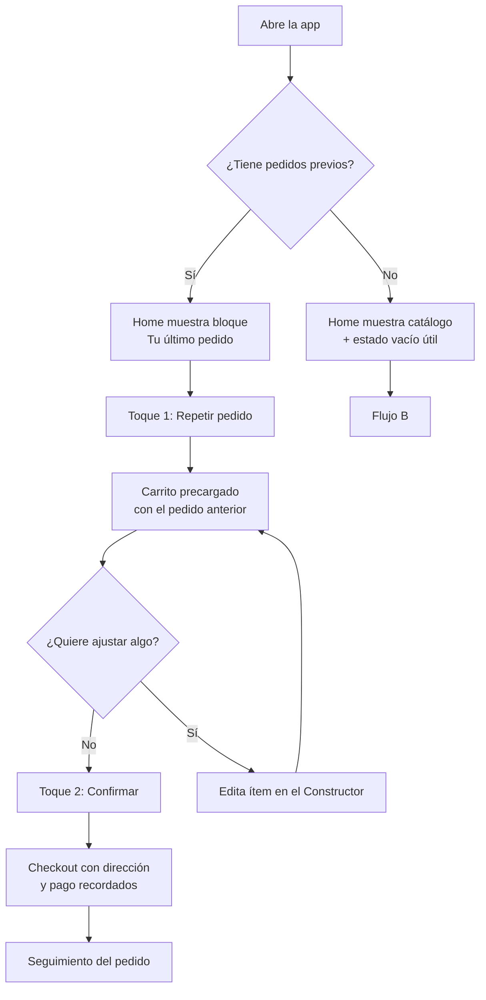
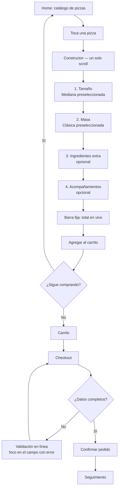
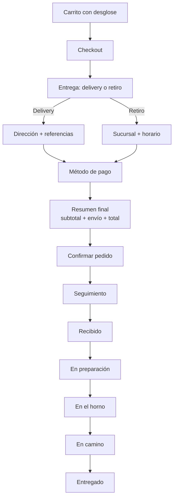

# Etapa 2 — Flujos de usuario

Tres flujos. El primero es el que más rinde, y por eso es el más corto.

---

## Flujo A — Recompra (el camino de dos toques)



**La decisión de diseño que importa acá:** el botón *Repetir pedido* lleva al **carrito**,
no directo al checkout. Es un toque más, pero elimina el "todo o nada" que critiqué de la
App C en el teardown: el usuario ve exactamente qué está por comprar y puede cambiar la
bebida o sacar un ítem sin abandonar el camino rápido.

**Estado vacío (usuario nuevo):** el bloque de recompra no se renderiza como un placeholder
gris. Simplemente no está, y la home arranca con las pizzas más pedidas. El espacio no se
desperdicia.

---

## Flujo B — Pedido nuevo con personalización



**Puntos clave:**

- **Se puede llegar a "Agregar al carrito" sin tocar nada.** Tamaño y masa vienen
  preseleccionados con la opción más pedida. El usuario que no quiere decidir, no decide.
- **El total nunca desaparece.** Barra fija inferior, dentro de la zona del pulgar, con el
  precio recalculándose en cada toque.
- **Cada sección tiene número y encabezado.** Es la mitigación del supuesto S4: el scroll
  único no debe sentirse como una pared de opciones.
- **Los recargos se muestran en el punto de decisión.** "Grande +$1.800" al lado de la
  opción, no sumado silenciosamente al final.

---

## Flujo C — Checkout y seguimiento



**Sobre el desglose:** subtotal, envío y total van visibles **antes** del botón de
confirmar, no después. Es la contrapartida directa del punto de fuga #1 de la
investigación.

**Sobre los estados de seguimiento:** cinco estados con nombre en lenguaje natural y tiempo
estimado. El estado activo se distingue por color *y* por peso tipográfico *y* por un
indicador de posición — nunca solo por color, porque eso rompe accesibilidad para daltonismo.

---

## Mapa de navegación

```
Inicio (tab)
 ├── Repetir último pedido ──────► Carrito
 └── Pizza del catálogo ─────────► Constructor ──► Carrito

Carrito (tab, con badge de cantidad)
 └── Checkout ──► Confirmar ──► Seguimiento

Seguimiento
 └── Volver al inicio
```

Dos tabs en la v1: **Inicio** y **Carrito**. Perfil y Pedidos entran en la etapa 2 —
agregar tabs vacías ahora solo enseña al usuario que hay lugares donde no vale la pena ir.
